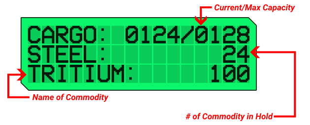

<p align="center">
  
</p>

# EDx52display

Seamlessly reads Elite Dangerous journal data and presents real-time system, planet, and cargo information on your Saitek/Logitech X52 Pro MFD. Updated and Maintained

> **Note:** *This software only works with the Saitek/Logitech X52 Pro. The standard X52 HOTAS does not support third-party software for the MFD.*

> **Note:** *It is recommended to run a tool that uploads data to EDSM, such as [ED Market Connector](https://github.com/Marginal/EDMarketConnector). Doing this will ensure that any new discoveries can be shown on the display.*

※*Development is ongoing. See the [changelog](https://github.com/pellux-network/EDx52display/blob/master/CHANGELOG.md) for details on recent fixes and features.*

## Running

### Users
Simply download the latest release zip from the [Releases](https://github.com/pellux-network/EDx52display/releases/latest) page. Unzip it into a location of your choosing such as `C:\Games\`. If you haven't modified Elite Dangerous' journal path and don't want to disable any pages, simply run the included `.exe` and your MFD should immediately begin loading. If your journal file location is changed or you wish to disable any pages, check the [Configuration](#configuration) section below.

### Developers
Build the app by running `release.ps1` or running `go build -v -o EDx52display.exe` making sure to have the latest version of Go installed. You can always clone the repo or download its zip and use this method to get the latest changes described in the Planned Release section of the [changelog](https://github.com/pellux-network/EDx52display/blob/master/CHANGELOG.md)

※*To close the app, right click its icon in the system tray and click `Quit`*

<p style="font-size: 12px" align="right">
  <a href="#edx52display">Return to top</a>
</p>

## Output

Running this application will show 3 pages of information on your MFD. Most of this information is sourced from EDSM.net.

Of particular note is:

- Live view of cargo hold - *keep track while mining*
- Value of scanning and mapping the system - *know where to go, without checking system map*
- Surface gravity of the planet you are about to land on - *avoid becoming a stellar pancake!*

### Page 1: Destination

This page adapts based on your current target. If an in-system destination is selected, the "System Target" page will be displayed, showing the name of the celestial body along with relevant information from EDSM, such as its gravity. If the target is another system, the "FSD Target" page will appear, providing the name of the next jump's system, details about whether the star is scoopable, and additional system information.

### Page 2: Current System / Planet

This page adapts contextually based on your current position. When you are in open space or not near a planetary body, it displays information about your current system, such as system name and other relevant details. However, when you approach or are close to a planet, the page switches to show planet-specific information sourced from EDSM, including:

- Planet name
- Surface gravity (important for safe landings)
- Available materials on the planet, if any

This ensures you always have the most relevant data for your immediate surroundings, whether in-system or near a planetary body.

### Page 3: Cargo

This page displays the current occupancy of your cargo hold along with a detailed list of specific items and their respective quantities.

<p align="center">
  
</>

<p style="font-size: 12px" align="right">
  <a href="#edx52display">Return to top</a>
</p>

## Buttons / Navigation

This tool will use both function wheels on the MFD.

The left wheel will scroll between pages

The right wheel will scroll a page up and down

**Pressing** the right wheel will refresh data from EDSM. The display will cache values from EDSM to avoid hitting their API rate limit. 
Pressing this button will update with new data, which is useful if you have recently scanned the system and uploaded data with ED Market Connector or similar tools.

<p style="font-size: 12px" align="right">
  <a href="#edx52display">Return to top</a>
</p>

## Configuration

The application uses a `conf.yaml` file in the installation folder to configure its behavior.

`conf.yaml`:
```yaml
journalsfolder: "%USERPROFILE%\\Saved Games\\Frontier Developments\\Elite Dangerous"

pages:
  destination: true
  location: true
  cargo: true
```

- **journalsfolder**: Path to your Elite Dangerous journal files. You can use environment variables like `%USERPROFILE%`.
- **pages**: Enable or disable pages by setting them to `true` or `false`.
  - `destination`: Show the Destination/FSD Target page.
  - `location`: Show the Current Location/Planet page.
  - `cargo`: Show the Cargo page.

※*If you disable a page, it will not appear on the MFD*

<p style="font-size: 12px" align="right">
  <a href="#edx52display">Return to top</a>
</p>

## Troubleshooting

This application reads the journal files of your elite dangerous installation.
These are normally located in `%USERPROFILE%\\Saved Games\\Frontier Developments\\Elite Dangerous` on Windows. However, if your installation
uses a different location, you should update the conf.yaml file in the installation folder.

### Command Line Arguments

- `--log`: Set the desired log level. One of:
  - panic 
  - fatal 
  - error
  - warning
  - info (default)
  - debug 
  - trace

<p style="font-size: 12px" align="right">
  <a href="#edx52display">Return to top</a>
</p>

## Credits

### Original Credits
This project owes a great deal to [Anthony Zaprzalka](https://github.com/AZaps) in terms of idea and execution
and to [Jonathan Harris](https://github.com/Marginal) and the [EDMarketConnector](https://github.com/Marginal/EDMarketConnector) project
for the CSV files of names for all the commodities.

### Fork Credits
- Thanks to original author [Peter Pakkenberg](https://github.com/peterbn) and the author I forked from [rinkulu](https://github.com/rinkulu/)
- Thanks to [pbxx](https://github.com/pbxx) for the icons and help with page layouts

<p style="font-size: 12px" align="right">
  <a href="#edx52display">Return to top</a>
</p>
