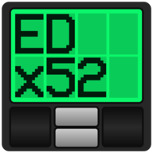

  

  
  
  
  
  

# EDx52display

Seamlessly reads Elite Dangerous journal data and presents real-time system, planet, cargo, and other information on your Saitek/Logitech X52 Pro Multi-Function Display. Updated and Maintained.

> **INFO:** _This software only works with the Saitek/Logitech X52 Pro. The standard X52 HOTAS does not support third-party software for the MFD._

※_Development is ongoing. See the [changelog](https://github.com/pellux-network/EDx52display/blob/master/CHANGELOG.md) for details on recent fixes and features._

## Getting Started

Simply download the latest release zip from the [Releases](https://github.com/pellux-network/EDx52display/releases/latest) page. Unzip it into a location of your choosing such as `C:\Games\`. If you haven't modified Elite Dangerous' journal path and don't want to disable any pages, simply run the included `.exe` and your MFD should immediately begin loading.

If your journal file location is different than the default or you wish to disable any pages, check the [Configuration](link) page on the [Wiki](https://github.com/pellux-network/EDx52display/wiki) for more details.

> **INFO:** _It is recommended to run a tool that uploads data to the Elite Dangerous Data Network, such as [ED Market Connector](https://github.com/Marginal/EDMarketConnector). Doing this will ensure that any new discoveries can be shown on the display._

## [Wiki](https://github.com/pellux-network/EDx52display/wiki)

For additional information or help with any encountered issues, visit the [Wiki](https://github.com/pellux-network/EDx52display/wiki). This includes info on getting the correct drivers for the X52

## Credits

### Original Credits

This project owes a great deal to [Anthony Zaprzalka](https://github.com/AZaps) in terms of idea and execution
and to [Jonathan Harris](https://github.com/Marginal) and the [EDMarketConnector](https://github.com/Marginal/EDMarketConnector) project
for the CSV files of names for all the commodities.

### Fork Credits

- Thanks to original author [Peter Pakkenberg](https://github.com/peterbn) and the author this repo is forked from [rinkulu](https://github.com/rinkulu/)
- Thanks to [pbxx](https://github.com/pbxx) for icons, page layouts, and huge general improvements to the codebase

  <a href="#edx52display">Jump to top</a>

